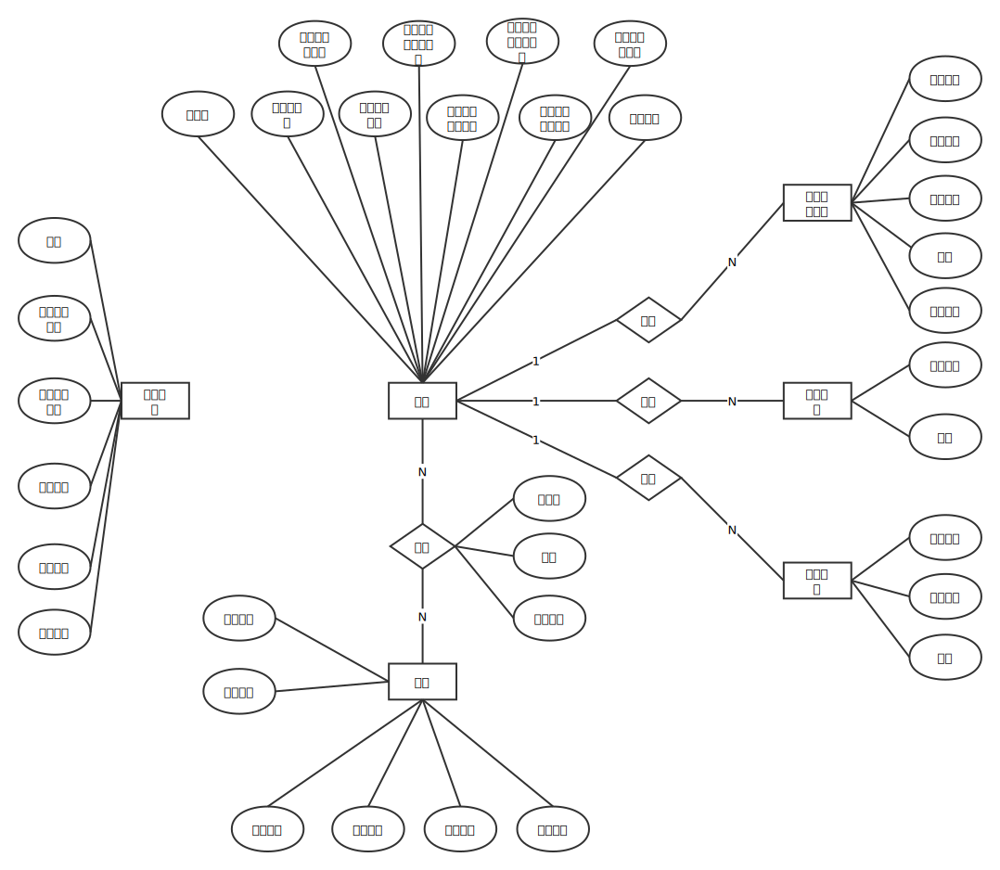
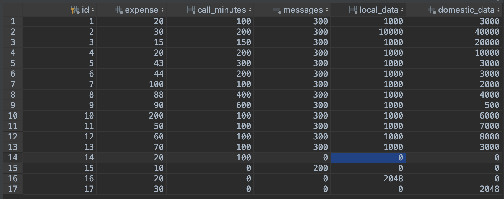
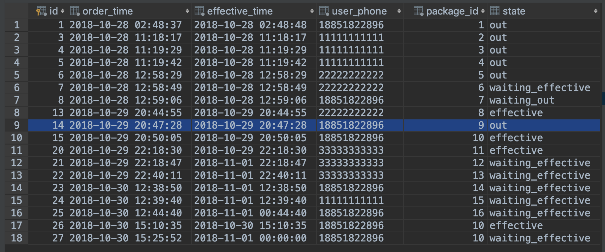

# 作业二说明文档

---

[TOC]

*项目使用 java 11 编写，请使用 java 11 编译器进行编译*

## 数据库设计

---

### ER 图

---



### 设计说明

---

1. **基准资费**

   考虑到基准资费可能发生变化，同时又需要记录历史的基准资费，故单独创建一张表来记录基准资费，要查找当前基准资费可通过查找最大生效时间的记录来获得

2. **套餐**

   记录套餐提供的通话时间、短信条数、本地流量和全国流量

3. **流量使用记录、通话记录和短信记录**

   消费记录主要用于支持生成用户历史月账单

4. **用户**

   用户本身记录的消费信息主要用于计算当前套餐使用情况和生成当前月账单

5. **订购**

   订购记录用户所有的订购套餐记录，通过正在订单状态字段来判断订单状态

### 数据库表说明

---

数据库中总共有 7 张表，介绍如下

| 表名称            | 说明                                                         |
| ----------------- | ------------------------------------------------------------ |
| basic_charge      | 用来记录基准资费的表，可以通过查找最近生效时间的记录来获得当前使用的基准资费 |
| call_record       | 用户的通话记录，用户的通话资费情况生成基于这张表             |
| data_usage_record | 用户流量使用记录，用户的流量资费情况生成基于此表             |
| message_record    | 用户的短信使用记录                                           |
| package           | 记录套餐的信息                                               |
| package_order     | 记录订单信息                                                 |
| user              | 记录用户信息，同时也记录了用户本月的各项花费指标             |

## 操作设计

---

### 套餐查询

---

#### 设计

- 输入：用户号码
- 采用策略：连接 `package	` 和 `package_order` 两张表，筛选出状态为正在生效的套餐（正在生效或者已经退订单下月失效），然后计算出当前套餐使用情况，然后打印生效套餐的信息及其消耗信息
- 计算当前套餐使用情况思路及说明：

  1. `user` 表记录了用户本月的通话、短信和流量的使用情况（套餐内的和套餐外的分开记录），按照套餐订购的时间顺序用这些记录在相应数据上做减法，如果当前套餐不够减，则交给下一个套餐，如果所有套餐都不够减，则将超出部分记录到用户的额外消耗字段上。
  2. 用户订购的套餐按照套餐订购的顺序进行消耗（即先定的套餐会先被消耗）
  3. 如果用户立即退订了某个套餐，该套餐提供的通话、短信、流量都会按照基准资费进行收费，需要再次执行 1 中描述的计算来获得该套餐的消耗情况，然后将这些消耗从 `user` 记录的套餐内的通话、短信和流量减去，转而加到套餐外的通话、短信和流量上。所以**如果立即退订了某个套餐不会对后面的套餐使用产生影响**。

#### 运行

此次运行使用了用户 `18851822896` ，使用的方法是 `PlanService` 中的 `effectivePlans`

```java
planService.effectivePlans("18851822896");
```

- 执行查询，运行时间为 `382ms`

  

### 套餐订购记录查询

---

#### 设计

- 输入：用户号码
- 采用策略：查询 `packaeg_orders` 表中用户的订购历史信息，结果按照订单状态和订购时间排序后输出

#### 运行

此次运行使用了用户 `18851822896` ，使用的方法是 `PlanService` 中的 `orderInforMation` 

```java
planService.orderInformation("18851822896"); //执行订单查询操作
```

- 执行查询，运行时间为 `362ms` 

  

### 立即订购

---

#### 设计

- 输入：用户的手机号码和套餐的 id 
- 采用策略：从 `package` 表中获得套餐信息，然后从 `user` 表中获得用户信息，然后测试用户余额是否足够，如果足够则创建订单信息将订单状态设置为生效，然后写入 `package_orders` 表中；如果用户余额不足够，则不执行任何操作

#### 运行

此次运行使用用户 `18851822896` 订购了 `10` 号套餐，使用的方法是 `PlanService` 中的 `subscribeInTime` 方法

```java
planService.subscribeInTime(10, "18851822896");
```

1. 运行前的情况

     订单表

     

     用户表

     

     套餐表

     	

2. 执行

   

     运行时间为 `314ms`

3. 执行后各表的状态

     订单表新增一条记录

     

      用户表中用户余额减去 10 号套餐费用 200 元后变成 100 元

     

### 次月订购

---

#### 设计

- 输入：用户手机号和订单编号
- 采用策略：从数据库中获得套餐信息和用户信息，然后创建订单，将订单生效时间设置为下个月的第一天的 0 点，将订单状态设置为“等待生效”
- 此操作不会减少用户当前余额
- 支持套餐叠加

#### 运行

此次运行使用用户 `18851822896` 订购了 `17` 号套餐，使用的方法是 `PlanService` 中的 `subscribeNextMonth` 方法

```java
planService.subscribeNextMonth(10, "18851822896")；
```

1. 执行，运行时间是 `303ms`

   

2. 各表变化情况

   由于不会有扣钱操作，所以用户表没有发生

   

   订单表新增一条订单，可以看到订单的生效时间是下个月的第一天，订单状态是等待生效

   

### 立即退订

---

#### 设计

- 输入是用户号码和套餐编号
- 采取策略：如果套餐还未生效，则直接修改订单状态为“失效”，如果订单已经生效，则将套餐费全部退还给用户，同时将用户的已经使用的套餐内使用的通话、短信、流量按照当前的基准资费进行计算后要求用户额外支付
- 如果存在重复套餐，那么按照订购套餐的时间顺序依次退订
- 计算套餐使用的思路同套餐查询操作中描述的一致

#### 运行

此次运行使用了用户 `18851822896` 退订 `9` 号套餐，使用的方法是 `PlanService` 中的 `unsubscribeInTime`

```java
planService.unsubscribeInTime(9, "18851822896");
```

- 执行退订，运行时间是 `298ms`

  

- 执行后，用户余额被扣除 `2500 - 90` 元，余额是 `100 - 2410 = -2310` 元 

  

- 执行前的订单情况

  

  执行后的订单情况，可以看到订单状态已经为“失效”即 `out` 

  

### 次月退订

---

#### 设计

- 输入是用户号码和套餐编号
- 采取策略：如果订单还未生效，直接修改订单状态为失效；如果订单正在生效，则将订单状态修改为“等待失效”后写入数据库。然后每个月的第一天对数据库进行扫描，将所有等待失效的订单的状态全部改为失效。
- 用户不需要付出额外的代价
- 如果存在重复套餐，那么按照订购套餐的时间顺序依次退订

#### 运行

此次运行使用了用户 `18851822896` 退订 `10` 号套餐，使用的方法是 `PlanService` 中的 `unsubscribeNextMonth`

- 执行退订，运行时间为 `271ms`

  

- 执行退订前数据库中订单的信息

  

  执行后，可以看到蓝色记录中的订单状态已经改为“等待失效“即 `waiting_out` 

  

### 通话资费生成

---

#### 设计

- 输入：用户号码和查询的月范围（多少个月之内）
- 采取策略：直接从 `call_record` 表中获取用户通话记录信息后显示

#### 运行

此次运行使用了用户 `18851822896` ，查询的月范围是2个月之内，使用的方法是 `BillService` 中的 `showCallBills`

```java
billService.showCallBills(2, "18851822896");
```

- 查看当前用户的通话记录

  

- 执行查询，运行时间是 `262ms`

  

### 流量资费生成

---

#### 设计

- 输入：用户号码和查询的月范围（多少个月之内）
- 采取策略：直接从 `data_usage_record` 表中获取用户通话记录信息后显示

#### 运行

此次运行使用了用户 `18851822896` ，查询的月范围是2个月之内，使用的方法是 `BillService` 中的 `showDataBills`

```java
billService.showDataBills(2, "18851822896");
```

- 查看用户当前流量使用记录

  

- 执行查询，运行时间为 `297ms`

  

### 账单生成

---

#### 设计

- 输入：用户号码
- 采用策略：从用户表获取本月通话、短信和流量（套餐内和套餐外）信息，从订单表和套餐表中获取用户当前正在使用的套餐信息，从基准资费表中获取当前基准资费，然后计算用户账单中的各项指标

#### 运行

此次使用用户 `18851822896` ，使用的方法是 `BillService`的 `showMonthBill` 方法

```java
billService.showMonthBill("18851822896");
```

- 执行查询，运行时间是 `331ms`

  

## 优化思路

---

- `user` 表
  - 在 `user` 表中记录用户本月用户的通话、短信和流量使用情况，最初的想法是这样便于计算用户的套餐使用情况，但是没有考虑到一旦数据量过大之后由于既需要对 `user` 表进行频繁的更新操作，又要对 `call_record` , `message_record` 和 `data_usage_record` 做频繁的插入操作，而用户查询账单的操作有可能不会太频繁，这可能使得效率很低。优化的思路是去掉 `user` 表中记录的本月用户的通话、短信和流量使用情况，而通过三张记录表获得相关消费信息。
- `package_orders` 表
  - 每个用户订购的订单相对全部订单来说应该很小，这使得 `user_phone` 的选择性很好，检索比率很低，同时又有多个操作将 `user_phone` 作为筛选条件，所以可以考虑在 `user_phone` 一列上建立索引
- `call_record`, `data_usage_record` , `message_record` 表
  - 操作中通话、短信、流量记录通常需要按照时间筛选和排序，所以如果实际数据中 `start_time` 的检索比率很低的话可以建立索引

## 使用说明

---

### 测试说明

---

*项目使用 java 11 编写，请使用 java 11 编译器进行编译*

首先需要修改 `mybatis` 的配置文件，该文件位于 `src/main/resources` 路径下，对 `properties` 中的 `url` , `username` 和 `password` 修改为本地数据库相应信息，以便能够使 `mybatis` 生效

```xml
<properties>
    <property name="driver" value="com.mysql.jdbc.Driver"/>
    <property name="url" value="jdbc:mysql://localhost:3306/assignment2"/>
    <property name="username" value="root"/>
    <property name="password" value="123456"/>
</properties>
```

`main` 方法中已经列出了所有可用的方法，需要运行某方法只需将该方法注释去掉即可，**每个方法的作用在代码中有相应的注释，也可以参考操作设计中的运行标题下面关于调用方法的说明**


### 命令行说明

---

此次作业实现了命令行操控的方式，如果需要使用命令行，只需要在 `main` 方法中调用 `commandLine` 即可

```java
public static void main(String[] args) {
    commandLine();
}
```

- 命令行首先要求输入用户号码，需要输入 `user` 表中有的号码才能进入下一步操作
- 输入 `help` 得到当前命令行支持的命令信息

## 其他说明

---

- 计算操作运行时间方式

  ```java
  Instant start = Instant.now();
  billService.showMonthBill("18851822896"); // 此处执行需要计时的操作
  Instant end = Instant.now();
  System.out.println("spend time is " + Duration.between(start, end).toMillis() + " ms");
  ```

## 附录

---

### 数据库表描述

#### basic_charge 表

| Field                | Type    | Null | Key  | Default | Extra          | Description  |
| -------------------- | ------- | ---- | ---- | ------- | -------------- | ------------ |
| id                   | int(11) | NO   | PRI  | NULL    | auto_increment | id           |
| local_data_charge    | double  | NO   |      | NULL    |                | 本地流量计费 |
| domestic_data_charge | double  | NO   |      | NULL    |                | 全国流量计费 |
| call_charge          | double  | NO   |      | NULL    |                | 通话计费     |
| message_charge       | double  | NO   |      | NULL    |                | 短信计费     |
| effective_time       | date    | NO   |      | NULL    |                | 生效时间     |

#### call_record 表

| Field      | Type     | Null | Key  | Default | Extra | Description  |
| ---------- | -------- | ---- | ---- | ------- | ----- | ------------ |
| start_time | datetime | NO   |      | NULL    |       | 通话开始时间 |
| duration   | int(11)  | NO   |      | NULL    |       | 通话时长/min |
| expense    | double   | NO   |      | NULL    |       | 此次通话计费 |
| user_phone | char(11) | NO   |      | NULL    |       | 用户号码     |

#### data_usage_record 表

| Field       | Type                     | Null | Key  | Default | Extra | Description  |
| ----------- | ------------------------ | ---- | ---- | ------- | ----- | ------------ |
| start_time  | datetime                 | NO   |      | NULL    |       | 使用开始时间 |
| end_time    | datetime                 | NO   |      | NULL    |       | 使用结束时间 |
| consumption | double                   | NO   |      | NULL    |       | 消耗流量/MB  |
| type        | enum('Domestic','Local') | NO   |      | NULL    |       | 流量类型     |
| expense     | double                   | NO   |      | NULL    |       | 花费         |
| user_phone  | char(11)                 | NO   |      | NULL    |       | 用户号码     |

#### message_record 表

| Field      | Type     | Null | Key  | Default | Extra | Description |
| ---------- | -------- | ---- | ---- | ------- | ----- | ----------- |
| send_time  | datetime | NO   |      | NULL    |       | 发送时间    |
| expense    | double   | NO   |      | NULL    |       | 花费        |
| user_phone | char(11) | NO   |      | NULL    |       | 用户号码    |

#### package 表

| Field         | Type    | Null | Key  | Default | Extra          | Description  |
| ------------- | ------- | ---- | ---- | ------- | -------------- | ------------ |
| id            | int(11) | NO   | PRI  | NULL    | auto_increment | id           |
| expense       | double  | NO   |      | NULL    |                | 套餐费用     |
| call_minutes  | int(11) | NO   |      | NULL    |                | 提供通话/min |
| messages      | int(11) | NO   |      | NULL    |                | 短信条数     |
| local_data    | double  | NO   |      | NULL    |                | 本地流量/MB  |
| domestic_data | double  | NO   |      | NULL    |                | 全国流量/MB  |

#### package_orders 表

| Field          | Type                                                      | Null | Key  | Default | Extra          | Description                                    |
| -------------- | --------------------------------------------------------- | ---- | ---- | ------- | -------------- | ---------------------------------------------- |
| id             | int(11)                                                   | NO   | PRI  | NULL    | auto_increment | id                                             |
| order_time     | datetime                                                  | NO   |      | NULL    |                | 订单下单时间                                   |
| effective_time | datetime                                                  | NO   |      | NULL    |                | 套餐生效时间                                   |
| user_phone     | char(11)                                                  | NO   |      | NULL    |                | 用户号码                                       |
| package_id     | int(11)                                                   | NO   |      | NULL    |                | 套餐编号                                       |
| state          | enum('effective','waiting_effective','out','waiting_out') | YES  |      | NULL    |                | 订单状态（生效中，次月生效，次月失效，已失效） |

#### user 表

| Field             | Type     | Null | Key  | Default | Extra | Description        |
| ----------------- | -------- | ---- | ---- | ------- | ----- | ------------------ |
| phone_number      | char(11) | NO   | PRI  | NULL    |       | 用户号码           |
| call_minutes      | int(11)  | NO   |      | NULL    |       | 套餐内已通话       |
| messages          | int(11)  | NO   |      | NULL    |       | 套餐内已发短信     |
| local_data        | double   | NO   |      | NULL    |       | 套餐内已用本地流量 |
| domestic_data     | double   | NO   |      | NULL    |       | 套餐内已用全国流量 |
| balance           | double   | NO   |      | NULL    |       | 余额               |
| out_call          | int(11)  | NO   |      | NULL    |       | 额外已用通话       |
| out_messages      | int(11)  | NO   |      | NULL    |       | 额外已用短信       |
| out_local_data    | double   | NO   |      | NULL    |       | 额外已用本地流量   |
| out_domestic_data | double   | NO   |      | NULL    |       | 额外已用国内流量   |

## 